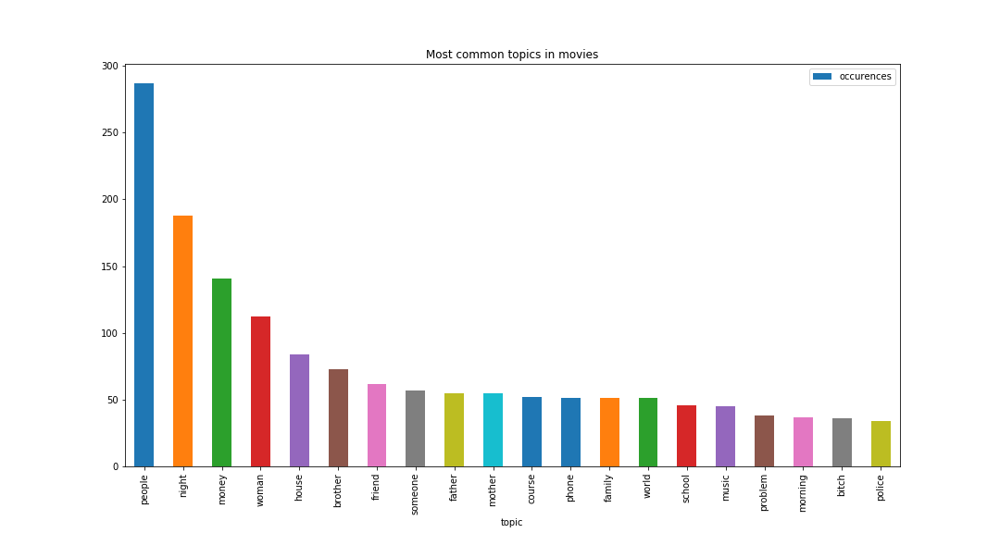
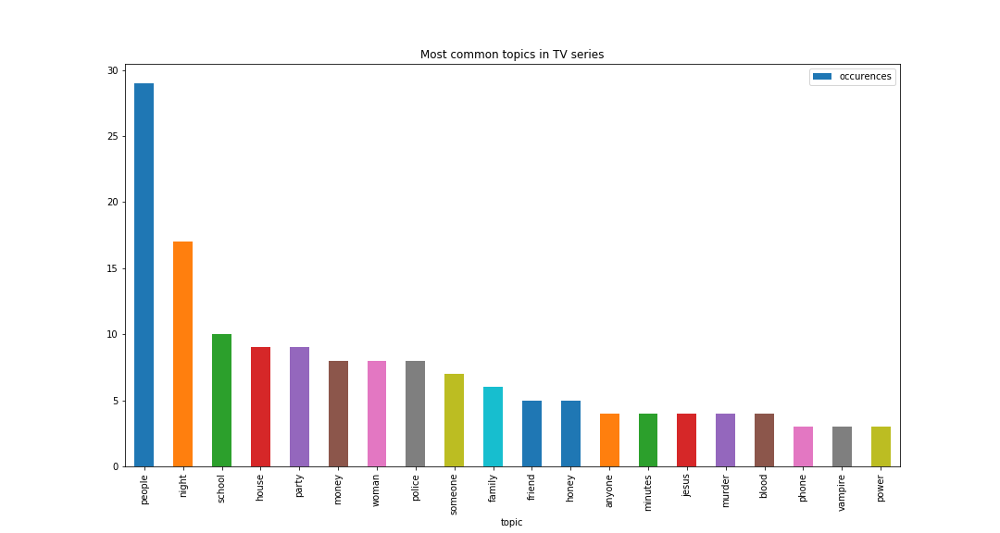

# Movies and TV Series
## Abstract

Movies and TV Series have become a central part of our lives all around the world.
With the rise of Video-on-Demand (VoD) services such as Netflix or Amazon Prime, people are spending more and more time in front of their screens, watching the brand-new released episode of their favorite TV series.
From fiction to documentary, these screenplays address a lot of different topics and often reflect the issues of society at a point in time.
Does the topic of a movie or TV series defines or at least influence its popularity?
This work will try to clarify this question, by first analysing the most common topics that have been observed over the years; we will then try to analyse the relationship between these topics and what seem to be the winning bets.
We will use the OpenSubtitles and IMDb databases to base our research.

## The importance of video medias

### The movie industry

The movie industry has always been present throughout the globe, with more than 1.332 trillions $ spent in production since its creation, and more than 637 billions $ worldwide box office (total money spent on theater tickets).
Today, the Internet Movie Database (IMDb) counts 505,391 movies and 156,890 TV Series (with a grand total of 2,917,237 TV series episodes).

We can see on the graph above that over the last couple decades, the movie industry has exploded, with the number of movies being made being multiplied by more than a factor 3 (4537 movies produced in 1998 against 17131 movies produced in 2018), and the yearly production cost being multiplied by more than a factor 17 (14.5 billions $ in 1998 against 251 billion $ in 2018)!
This increase clearly shows how much money is invested into movies every year, but what about the gross income?

The graph shown above clearly indicates that the movie industry generates billions of dollars every year (note that these correspond to the total money made through ticket selling, not the benefits made by the movies), all around the world.
We can clearly observe the exponential trends that highlights the importance of the seventh art in our culture, and the really central place it has in today's society.

### The rise of TV series

We just show how the movie industry imposed itself over the past decades, but what about the TV Series?
It appears that the TV Series are trickiest to analyse, because the TV golden age is really new.

As we can see on the graph above, the number of TV series really rose in the past 20 years (2,163 series produced in 1998 against 6,495 series produced in 2018). The budget for TV series remains lower than the ones for movies, but still is impressive for some: Game of Thrones, one of the most watched show in the world (which attracted this year more than [10 millions viewer](https://tvseriesfinale.com/tv-show/game-of-thrones-season-seven-ratings/) on average during its seventh season), has reached an unprecedented amount of [15 million $ per episodes](https://winteriscoming.net/2017/09/27/budget-episode-game-thrones-season-8-really-really-big/) for next year's eighth season (bringing the season's total budget to nearly 100 million $).

## Topics analysis

### Topic extraction

In order to extract the topics treated by a movie/TV series, we decided to base our analysis on the english subtitles: movies that often speaks about police and law have a higher probability to be a detective story talking about crime solving, whereas those that often speak about swords and castles have a higher probability to be medieval stories talking about wars.
In order to do so, we decided to filter the meaningful words, then extract the 5 words that appeared the most (which would then corresponds to our topics).

### Topics success

We can see the most common topics are not surprising: the top 3 consists of "people", "night" and "money". "People" make sense, as most of the subtitles consist of dialogues (a.k.a. people talking to each other) that should often involve references to people, thus being a central topic. We found "night" a bit surprising, as its popularity isn't straight forward, but our guess is that a lot of the scenarios take place at night (or at least involve seem late night parts), and the character are more likely to mention it. Lastly, "money" is one of those who would expect in the top 3, as it is a recurrent, if not omni-present, in the capitalist society we live in.

The TV series topics mostly align with the movie topics, we see some similarities - "people" and "night" being at the top. "Police" and "school" seem to be more prevalent in the series compared to the movies.

### Locations success

We can see on the map that most of the mentioned locations are set either in the USA or in Europe. This mostly explained by two phenomenons: the first one is that most of the movies and TV series are produced by those countries, which makes filming in this locations way easier for producers (as mentioned cities should mostly part of the shows themselves). We can however see a crushing majority of mentioned for the USA (with New York City being the real winner of this),  but we can still see some mentions of some other big cities (some examples would be Sydney, Tokyo, Mumbai, Buenos Aires, ...), and still proves that TV Series are not only an American business/property. Considering that we only considered movies and TV series that had a relative success (a.k.a. that were rated more than 5000 times), and that we only analysed english subtitles, our data analysis might be biased to show more importance towards english speaking countries, but we can definitely conclude that other countries still influence the movies and tv series industries.

## Conclusion
We can see that the popularity of the topics treated in movies are not very surprising, they represent very well the society we currently live in. However we have to note that due to data collection and filtering by number of votes our dataset was extremely reduced, and the missing data reduced it even more, therefore the results are to be taken with some precautions.
