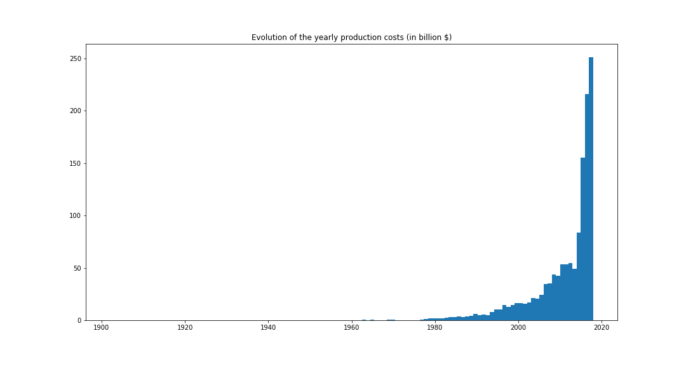
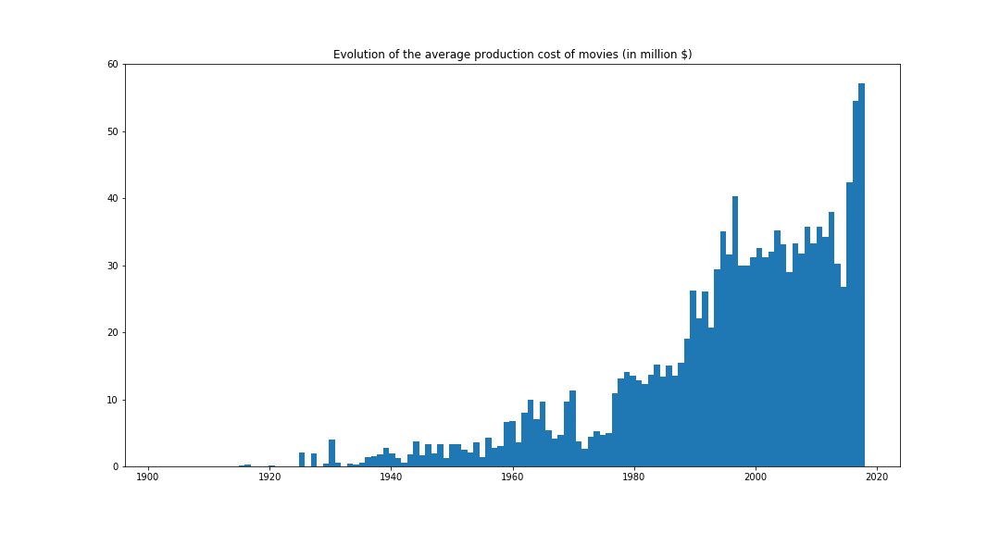
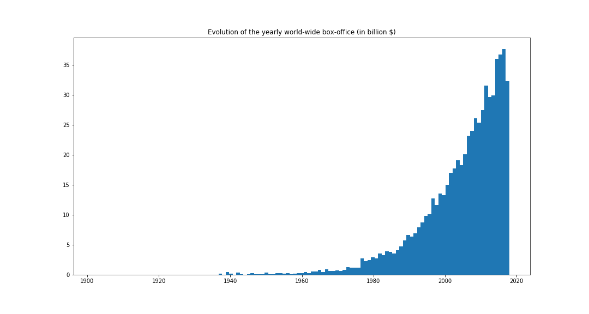

# Movies and TV Series
## Abstract

Movies and TV Series have become a central part of our lives all around the world.
With the rise of Video-on-Demand (VoD) services such as Netflix or Amazon Prime, people are spending more and more time in front of their screens, watching the brand-new released episode of their favorite TV series.
From fiction to documentary, these screenplay address a lot of different topics and often reflect the issues of society at a point in time, but does their success rely on it?
Does the topic of a movie or TV series defines or at least influence its popularity?
Can we predict the success of a show based on the themes that it treats?
This work will try to clarify this question, by first analysing the most common topics that have been observed over the years, as well as the period they rose and fell; we will then try to analyse the realtionship between these topics and what seem to be the winning bets.
We will use the OpenSubtitles and IMDb databases to base our research.

## The importance of video medias

### The movie industry

The movie industry has always been present throughout the globe, with more than ... $ spent in production since its creation, and more than ... $ worldwide box office gross.
Today, the Internet Movie Database (IMDb) counts nearly 500, 000 movies and 3, 500, 000 TV series episodes, which corresponds to more than ... hours of content.

We can see on the graph above that over the last couple decades, the movie industry has exploded, with the number of movies being made being multiplied by a factor ... (... movies produced in 1998 against .... movies produced in 2018) and the average production cost being multiplied by a factor  ...  (... $ in 1998 against ... $ in 2018), resulting in the yearly production cost being multiplied by a factor ... (... $ in 1998 against ... $ in 2018)!
This increases clearly show the how much money is invested into movies every year, but what about the gross income?

The graph shown above clearly indicates that the movie industry generates billion of dollars every year (note that these correspond to the total money made through ticket selling, not the amount given back to the producers), all around the world.
These numbers definitely show the importance of the seventh art in our culture, and the really central place it has in today's society.

### The rise of TV series

We just show how the movie industry imposed itself over the past decades, but what about the TV Series?
It appears that the TV Series are trickiest to analyse, because the TV golden age is really new.

As we can see on the graph above, the number of TV series really rose in the past 20 years. The budget for TV series remains lower than the ones for movies, but still is impressive for some: Game of Thrones, one of the most watched show in the world (which attracted this year more than [10 millions viewer](https://tvseriesfinale.com/tv-show/game-of-thrones-season-seven-ratings/) on average during its seventh season), has reached an unprecented amount of [15 million $ per episodes](https://winteriscoming.net/2017/09/27/budget-episode-game-thrones-season-8-really-really-big/) for next year's eighth season (bringing the season's total budget to nearly 100 million $).
To show the 

## Topics analysis

### Topic extraction

In order to extract the topics treated by a movie/TV series, we decided to base our analysis on the english subtitles: movies that often speaks about police and law have a higher probability to be a detective story talking about crime solving, whereas those that often speak about swords and castles have a higher probability to be medieval stories talking about wars.
In order to do so, we decided to filter the meaningfull words (by filtering out the stop words, preposition, ponctuation, ...) and then extract the topics of each remaining words, and then aggregate over the words (by counting the number of occurences for each topic).
We decided to keep only the topics that appeared more than ... times and then keep only the ... most frequent topics for each movie/TV Series.

### Topics success
Most common topics

Relationship between topics

## Conclusion
